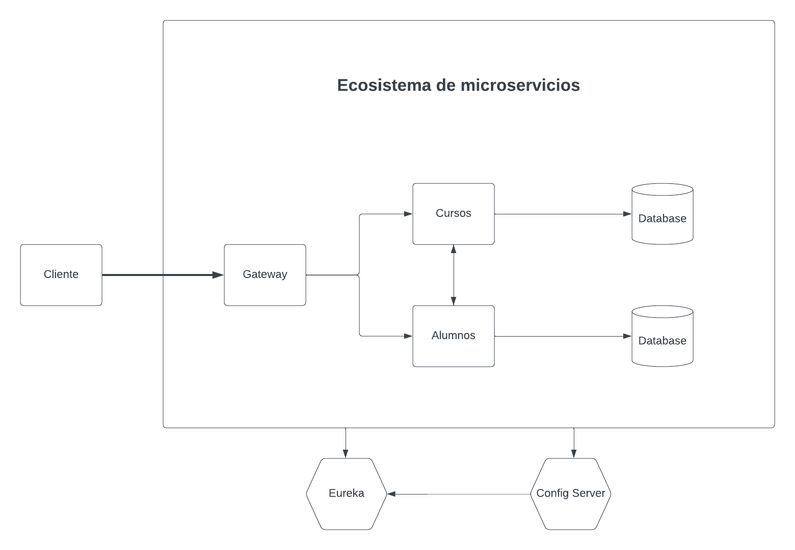

# Microservice

En este repositorio comenzare un pequeño proyecto poniendo en practica lo aprendido con microservicios.
El proyecto sera el siguiente:

    

Se administraran cinco microservicios:
* Gateway: un servicio encargo de distribuir las peticiones a los servicios correspondientes
* Curso: un servicio para administrar cursos, conectado a su propia base de datos.
* Alumnos: un servicio para administrar alumnos, conectado a su propia base de datos.
* Config Server: un servicio encargado de centralizar las configuraciones de cada servicio dentro del ecosistema.
* Eureka: un servicio encargado de registrar otros servicios dentro de un mismo ecosistema.

A medida el proyecto se vaya desarrollando, se podran incluir o no otros patrones de arquitectura, ademas del gateway por ejemplo.
